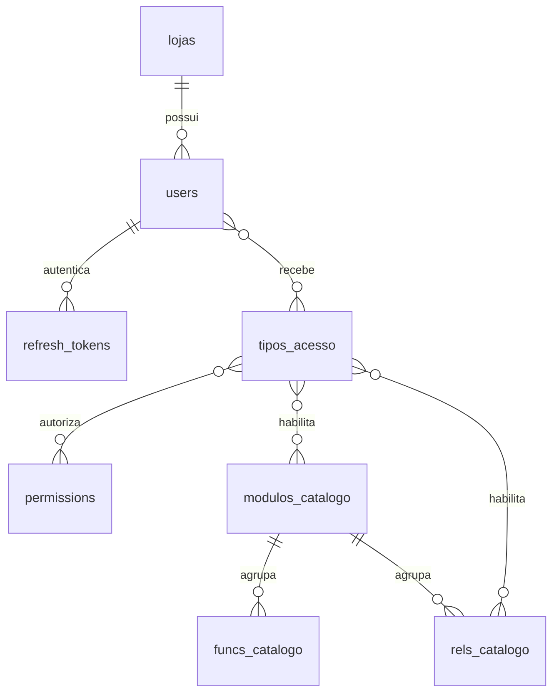

# Modelo ER — Usuários e RBAC

`users.deleted_at` implementa soft delete. Refresh tokens são opacos; somente o
SHA-256 é persistido. O enum PostgreSQL `tipo_usuario` contém os 12 tipos
definidos no épico.

## Divergência encontrada no mock

Em 19 de junho de 2026, `assets/js/admin/state.js` contém 33 lojas e 35
usuários (2 super admins e 33 PDVs). `assets/js/admin/tipos-acesso.js` contém
15 módulos, 16 funções e 19 relatórios. Esses totais divergem dos 32, 19 e 25
citados no card. O seed usa o conteúdo efetivamente presente no frontend, sem
inventar registros ausentes.
